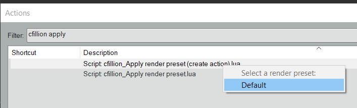

## Tevio - Render Video mp4 h264 Time Selection
 

`description:` This custom action is used to render a portion of video selected over time in a new track.

### Note

- Tested on Reaper x64 v6.23 on Windows 10
- Only one my custom script download
- Install **[SWS](https://www.sws-extension.org/)** and  **[ReaPack](https://reapack.com/)**
- Download and install **`<download>` : [Tevio Script_Render_Video_timesel](Script/Tevio%20-%20Set%20render%20time%20selection%20Track%20format%20to%20Video%20MP4%20h264.lua)**
- Customizable _(work in progress)_

### Preparation

- Save your project.
- Save your audio preset that you usually use with **'Default'** name.

- Launch _Script: cfillion_Apply render preset (create action).lua_ and select Default preset

### Creation
**_Create this custom action on Reaper in this order:_**

| Function |         Name Script           |
| ------------- | ------------------------------ |
| **1. Create subfolder**      | Script: mpl_Set render directory to 'Render' in project folder.lua|
| **2. Setting video**   | Script: Tevio - Set render time selection Track format to Video MP4 h264.lua|
| **3. AutoAdd rendered file**   | Script: mpl_Enable add rendered files to project after render.lua     |
|**4.  Render**  | File: Render project, using the most recent render settings, auto-close render dialog     |
| **5. Select last track**   | Script: me2beats_Select only last track.lua     |
| **6. Move last track up to the top**   | Script: X-Raym_Move selected tracks up to the top of the visible track list.lua  |
| **7. Disabel add render**  | Script: mpl_Disable add rendered files to project after render.lua     |
| **8. Apply render preset**   | Script: Apply render preset - Default.lua     |

### Execute
For use this Custom action you select time to render and video track.
Launch and voilà!
